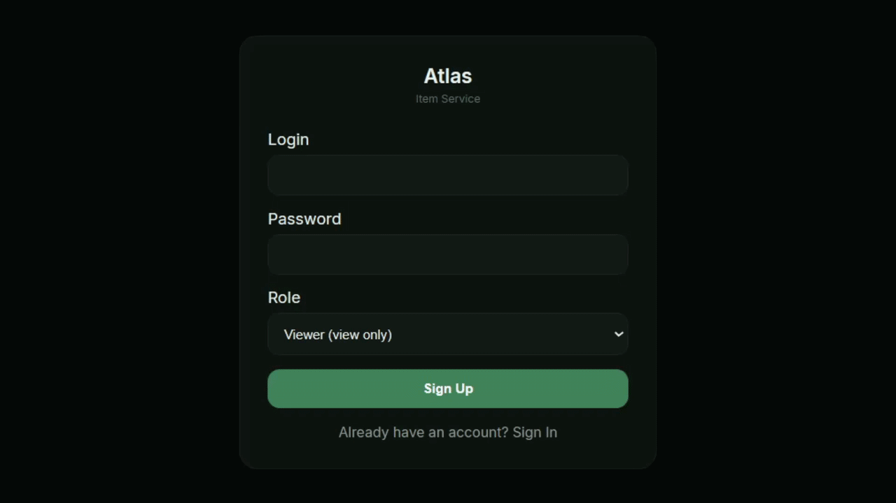
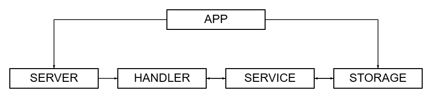

<h3 align="center">Warehouse inventory system with role‑based access, full audit history via DB triggers, and CSV export.<h3>

##



<br>

## Table of Contents

- [Architecture](#architecture)
- [Installation](#installation)
- [Configuration](#configuration)
- [Shutting down](#shutting-down)
- [API](#api)
- [Request examples](#request-examples)

<br>

## Architecture

- **App** — the central orchestrator.
  Loads configuration, initializes logger, database connection, migrations, repository, service, HTTP server, and manages graceful shutdown via OS signals.

- **Server** — the HTTP server layer.
  Configurable Ginext-based server with read/write timeouts, header limits, and graceful shutdown support.

- **Handler** — HTTP request processing layer.
  Serves static files and HTML templates (login, item list), as well as JSON API. Implements JWT authentication and role‑based middleware.

- **Service** — business logic.
  Validates input, hashes passwords, generates/validates JWT tokens, calls the repository.

- **Storage** — the persistent data layer and source of truth (PostgreSQL).
  Works with users, items, item_history tables. Uses direct SQL with retry support via wb-go/dbpg.



<br>

## Installation
⚠️ Note: This project requires Docker Compose, regardless of how you choose to run it.  

First, clone the repository and enter the project folder:

```bash
git clone https://github.com/Pur1st2EpicONE/Atlas.git
cd Atlas
```

Then you have two options:

#### 1. Run everything in containers
```bash
make
```

This will start the entire project fully containerized using Docker Compose.

#### 2. Run Atlas locally
```bash
make local
```
In this mode, only PostgreSQL is started in container via Docker Compose, while the application itself runs locally.

⚠️ Note: Local mode requires Go 1.25.1 installed on your machine.

<br>

## Configuration

### Runtime configuration

Atlas uses two configuration files, depending on the selected run mode:

[config.full.yaml](./configs/config.full.yaml) — used for the fully containerized setup

[config.dev.yaml](./configs/config.dev.yaml) — used for local development

You may optionally review and adjust the corresponding configuration file to match your preferences. The default values are suitable for most use cases.

### Environment variables and notification credentials

Atlas uses a .env file for runtime configuration. You may create your own .env file manually before running the service, or edit [.env.example](.env.example) and let it be copied automatically on startup.
If environment file does not exist, .env.example is copied to create it. If environment file already exists, it is used as-is and will not be overwritten.

⚠️ Note: Keep .env.example for local runs. Some Makefile commands rely on it and may break if it's missing.

<br>

## Shutting down

Stopping Atlas depends on how it was started:

- Local setup — press Ctrl+C to send SIGINT to the application. The service will gracefully close connections and finish any in-progress operations.  
- Full Docker setup — containers run by Docker Compose will be stopped automatically.

In both cases, to stop all services and clean up containers, run:

```bash
make down
```

⚠️ Note: In the full Docker setup, the log folder is created by the container as root and will not be removed automatically. To delete it manually, run:
```bash
sudo rm -rf <log-folder>
```

⚠️ Note: Docker Compose also creates a persistent volume for PostgreSQL data (Atlas_postgres_data). This volume is not removed automatically when containers are stopped. To remove it and fully reset the environment, run:
```bash
make reset
```

<br>

## API

All endpoints are mounted under /api/v1. Responses follow a simple wrapper convention:

- Success: **200 OK** with JSON body **{"result": \<value>}**
- Error: appropriate status code with JSON body **{"error": "\<message>"}**

<br>

### Public endpoints

#### Authentication

```bash
POST /api/v1/auth/sign-up      # registration
```

```bash
POST /api/v1/auth/sign-in      # login
```

Request body stays the same for both requests:
```json
{
  "login": "Cool_cactus",
  "password": "qwerty",
  "role": "viewer"   // optional, defaults to "viewer"
}
```

Allowed roles: admin, manager, viewer.

On success, both endpoints return a JWT token:
```json
{
  "result": "eyJhbGciOiJIUzI1NiIsInR5cCI6IkpXVCJ9..."
}
```

<br>

### Protected endpoints (require JWT in Authorization: Bearer <token> header)

#### Get all items (any authenticated user)

```bash
GET /api/v1/items
```

Returns:
```json
{
  "result": [
    {
      "id": 1,
      "name": "Laptop",
      "description": "Powerful laptop",
      "quantity": 10,
      "price": 999.99,
      "created_at": "2025-01-01T12:00:00Z",
      "updated_at": "2025-01-01T12:00:00Z"
    }
  ]
}
```

<br>

#### Create item (requires manager or admin)

```bash
POST /api/v1/items
```

Request body:
```json
{
  "name": "Office chair",
  "description": "Ergonomic",
  "quantity": 50,
  "price": 149.99
}
```

<br>

## Request examples

⚠️ Note: When the service is running, a web-based UI is available at http://localhost:8080. The examples below demonstrate how to interact with the API directly using curl.

### Register a user

```bash
curl -X POST http://localhost:8080/api/v1/auth/sign-up \
  -H "Content-Type: application/json" \
  -d '{
    "login": "warehouse_manager",
    "password": "strong123",
    "role": "manager"
  }'
```

### Response

```json
{
  "result": "eyJhbGciOiJIUzI1NiIsInR5cCI6IkpXVCJ9..."
}
```

<br>

### Login

```bash
curl -X POST http://localhost:8080/api/v1/auth/sign-in \
  -H "Content-Type: application/json" \
  -d '{
    "login": "warehouse_manager",
    "password": "strong123"
  }'
```

### Response

```json
{
  "result": "eyJhbGciOiJIUzI1NiIsInR5cCI6IkpXVCJ9..."
}
```

<br>

### Get an item

```bash
curl http://localhost:8080/api/v1/items/1
```

<br>

### Create an item (manager)

```bash
curl -X POST http://localhost:8080/api/v1/items \
  -H "Content-Type: application/json" \
  -H "Authorization: Bearer <JWT_TOKEN>" \
  -d '{"name": "Gaming mouse", "quantity": 30, "price": 45.50}'
```

<br>

### Update quantity (manager)

```bash
curl -X PUT http://localhost:8080/api/v1/items/1 \
  -H "Content-Type: application/json" \
  -H "Authorization: Bearer <JWT_TOKEN>" \
  -d '{"quantity": 28}'
```

<br>

### Delete an item (admin only)

```bash
curl -X DELETE http://localhost:8080/api/v1/items/1 \
  -H "Authorization: Bearer <JWT_TOKEN>"
```

<br>

### Get history with filters (admin)

```bash
curl "http://localhost:8080/api/v1/items/1/history?action=UPDATE&limit=5" \
  -H "Authorization: Bearer <JWT_TOKEN>"
```

<br>

### Export history to CSV

```bash
curl "http://localhost:8080/api/v1/items/1/history?export=csv" \
  -H "Authorization: Bearer <JWT_TOKEN>" \
  --output item_history.csv
```
